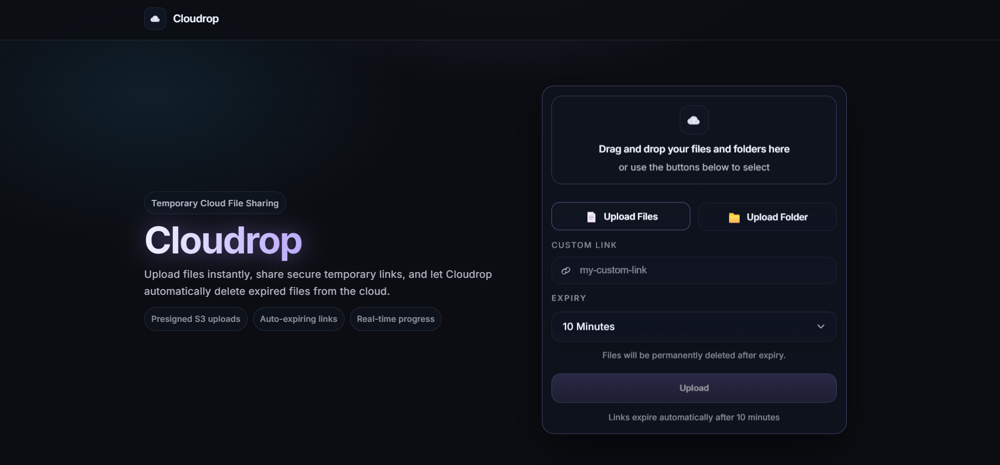
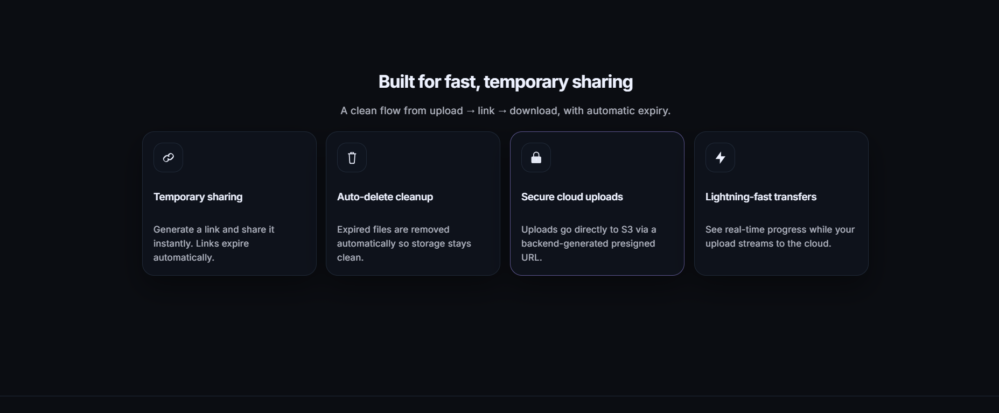
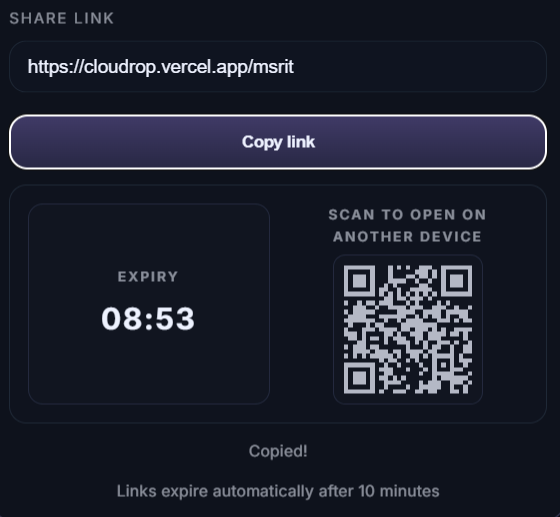
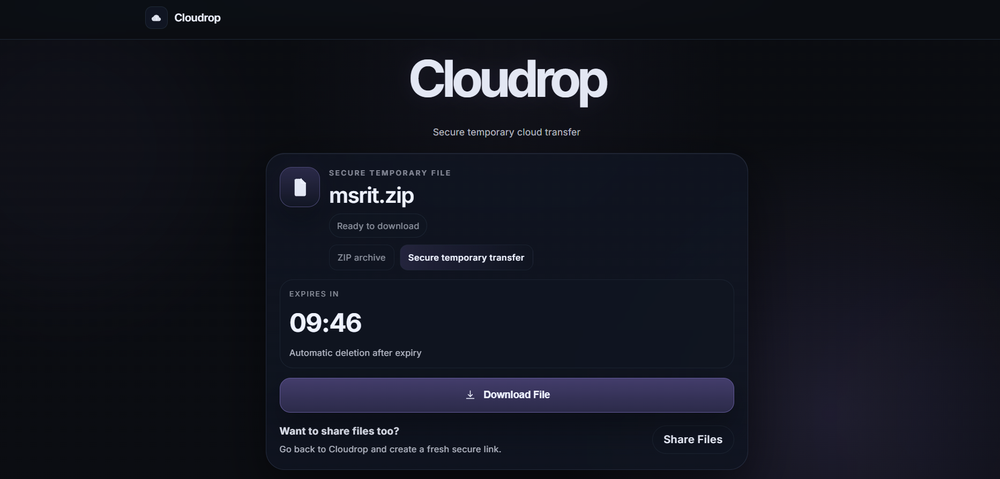

# ☁️ Cloudrop

<p align="center">
  
</p>

<p align="center">
  <b>Secure temporary cloud file sharing with auto-expiring links.</b>
</p>

<p align="center">
  Upload files instantly, generate temporary share links, and let Cloudrop automatically clean up expired files from the cloud.
</p>

---

<p align="center">


</p>

---

# 📑 Table of Contents

- [Description](#-description)
- [Features](#-features)
- [AWS Cloud Architecture](#-aws-cloud-architecture)
- [System Architecture](#-system-architecture)
- [Upload Workflow](#-upload-workflow)
- [Tech Stack](#-tech-stack)
- [Quick Start](#-quick-start)
- [Environment Variables](#-environment-variables)
- [Key Dependencies](#-key-dependencies)
- [Run Commands](#-run-commands)
- [Screenshots](#-screenshots)
- [Project Structure](#-project-structure)
- [Security](#-security)
- [Performance Optimizations](#-performance-optimizations)
- [Future Improvements](#-future-improvements)
- [Development Setup](#-development-setup)
- [Contributing](#-contributing)

---

# 📝 Description

Cloudrop is a modern cloud-native temporary file sharing platform built using React and AWS serverless technologies.

It allows users to:
- upload files and folders
- generate temporary secure links
- share downloadable content instantly
- automatically expire uploaded files
- securely upload directly to cloud storage

Cloudrop is designed with a premium modern UI and scalable serverless architecture, making it lightweight, fast, and production-ready.

---

# ✨ Features

- 📁 Multiple file uploads
- 📂 Folder upload support
- 📦 Automatic ZIP packaging
- 🔗 Temporary secure share links
- ⏳ Expiry countdown timers
- 📱 QR code sharing
- ⚡ Real-time upload progress
- ☁️ Secure AWS S3 uploads
- 🧹 Auto-delete cleanup flow
- 🎨 Premium responsive UI
- 🌍 Cloud-native architecture
- 🔒 Presigned upload security
- 📥 Elegant download page experience

---

# 🌐 Live Demo

🔗 https://cloudrop.vercel.app/

Experience Cloudrop live:
- Upload files & folders
- Generate temporary links
- Download securely
- Share using QR codes

# ☁️ AWS Cloud Architecture

Cloudrop uses a modern serverless AWS infrastructure to provide scalable and secure temporary file sharing.

## 🔹 AWS Services Used

| Service | Purpose |
|----------|----------|
| **Amazon S3** | Stores uploaded files and ZIP archives securely |
| **AWS Lambda** | Handles backend upload and metadata logic |
| **Amazon API Gateway** | Exposes secure backend REST APIs |
| **Amazon DynamoDB** | Stores file metadata and expiry details |
| **Vercel** | Hosts and deploys the frontend globally |

---

# 🏗️ System Architecture

```text
Frontend (React + Vercel)
            ↓
      API Gateway
            ↓
        AWS Lambda
            ↓
 ┌─────────────────────┐
 ↓                     ↓
Amazon S3         DynamoDB
(File Storage)    (Metadata Storage)
```

---

# ⚙️ Upload Workflow

## 📤 Upload Flow

```text
User Uploads Files/Folders
            ↓
Files are packaged into ZIP (if required)
            ↓
Frontend requests presigned upload URL
            ↓
AWS Lambda generates secure S3 upload URL
            ↓
Browser uploads directly to Amazon S3
            ↓
Metadata saved into DynamoDB
            ↓
Temporary share link generated
            ↓
Recipient downloads via secure link
```

---

# 🔒 Security

## ✅ Presigned Upload URLs

Cloudrop uses secure presigned S3 URLs so:
- AWS credentials are never exposed
- uploads go directly to S3
- backend remains secure

## ✅ Temporary Links

Each upload receives:
- temporary access
- expiry timers
- secure metadata mapping

## ✅ Serverless Backend

Using AWS Lambda ensures:
- scalability
- low operational cost
- no dedicated server management

---

# 🚀 Tech Stack

## Frontend
- ⚛️ React
- ⚡ Vite
- 🎨 CSS Modules
- 🎞️ Framer Motion
- 📦 JSZip

## Backend
- ☁️ AWS Lambda
- 🌐 API Gateway
- 🪣 Amazon S3
- 🗄️ DynamoDB

## Deployment
- ▲ Vercel

---

# ⚡ Quick Start

```bash
# Clone repository
git clone https://github.com/KarthikMaiya/Cloudrop.git

# Navigate into project
cd Cloudrop

# Install dependencies
npm install

# Start development server
npm run dev
```

---

# 🌍 Environment Variables

Create a `.env` file:

```env
VITE_API_URL=your-api-gateway-url
```

---

# 📦 Key Dependencies

```json
qrcode.react: ^4.2.0
jszip: ^3.10.1
react: ^19.2.6
react-dom: ^19.2.6
react-router-dom: ^7.6.2
framer-motion
```

---

# 🚀 Run Commands

| Command | Description |
|----------|-------------|
| `npm run dev` | Start development server |
| `npm run build` | Production build |
| `npm run lint` | Run ESLint |
| `npm run preview` | Preview production build |

---

# 📸 Screenshots

## 🏠 Landing Page

Modern premium landing page with:
- drag & drop uploads
- folder sharing
- temporary link generation
- responsive cloud-native UI

<p align="center">
  
</p>

---

## ⚡ Features Section

Cloudrop includes:
- temporary sharing
- secure S3 uploads
- auto-delete cleanup
- real-time progress tracking

<p align="center">
  
</p>

---

## 🔗 Share Link & QR Sharing

Each upload generates:
- secure temporary link
- expiry countdown
- QR code for device-to-device sharing

<p align="center">
  
</p>

---

## 📥 Download Page

Premium secure download experience with:
- countdown timer
- secure transfer UI
- responsive design
- temporary archive downloads

<p align="center">
  
</p>

---

# 🎨 UI/UX Design Philosophy

Cloudrop focuses on:
- premium dark-mode aesthetics
- cloud-native modern UI
- smooth interactions
- distraction-free experience

## Design Highlights

- 🌌 Glassmorphism-inspired UI
- ✨ Purple glow effects
- ⚡ Smooth transitions
- 🧊 Minimal modern typography
- 📱 Responsive layouts

---

# 📁 Project Structure

```bash
.
├── eslint.config.js
├── index.html
├── package.json
├── public
│   ├── favicon.svg
│   └── icons.svg
├── screenshots
│   ├── landing-page.png
│   ├── features-section.png
│   ├── share-link.png
│   └── download-page.png
├── src
│   ├── App.css
│   ├── App.jsx
│   ├── components
│   ├── pages
│   ├── utils
│   └── main.jsx
├── vercel.json
└── vite.config.js
```

---

# ⚡ Performance Optimizations

Cloudrop includes:
- direct single-file uploads
- smart ZIP generation
- optimized upload flow
- real-time upload progress
- efficient temporary metadata handling

---

# 📈 Future Improvements

- 🌍 Custom domains
- 👤 Authentication system
- 📊 Upload analytics
- 📥 Partial downloads
- 📱 Mobile application
- 🧠 AI-powered organization
- 📦 Multipart upload optimization

---

# 🛠️ Development Setup

## Requirements

- Node.js v18+
- npm or yarn
- AWS account
- Vercel account

## Install

```bash
npm install
```

## Start locally

```bash
npm run dev
```

---

# 👥 Contributing

Contributions are welcome.

## Steps

1. Fork the repository
2. Clone your fork
3. Create a feature branch
4. Commit changes
5. Push to GitHub
6. Open Pull Request

---

# 💡 Inspiration

Cloudrop was built to explore:
- serverless cloud architecture
- scalable file sharing systems
- secure temporary storage workflows
- premium frontend experiences

---

# 👨‍💻 Author

### Karthik Maiya

Built using React, AWS, and Vercel.

---

# ⭐ Support

If you like this project:

- ⭐ Star the repository
- 🍴 Fork it
- 🚀 Share it

---

<p align="center">
  <b>☁️ Cloudrop — Fast. Temporary. Secure.</b>
</p>
